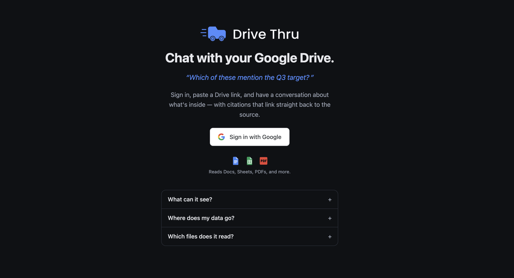
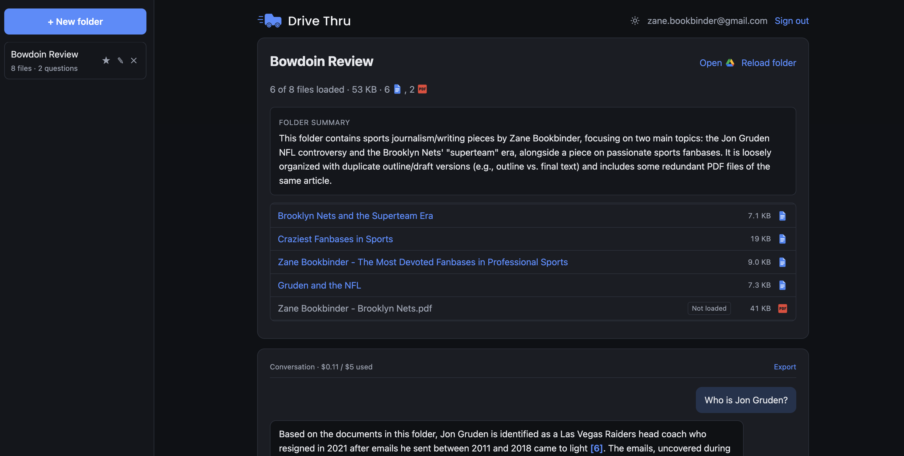
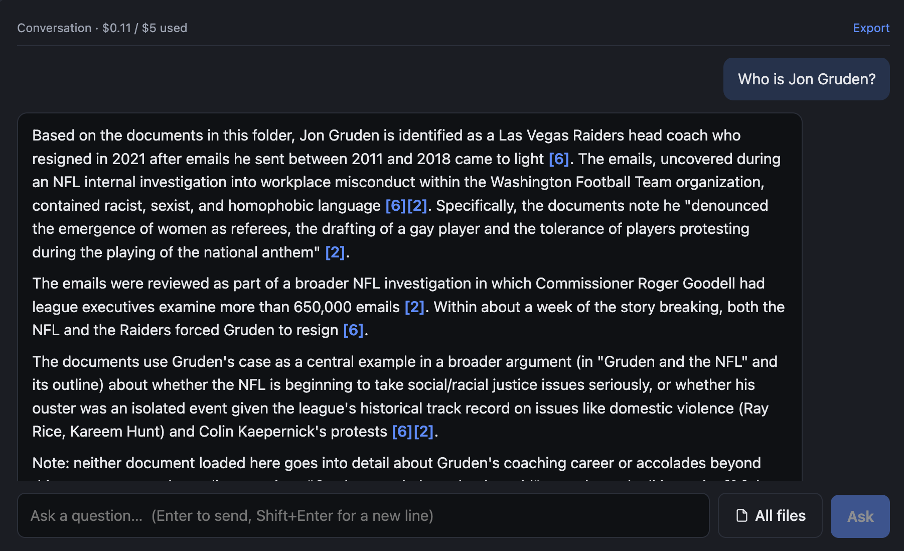

<div align="center">
  
  

  <p><strong>Chat with your Google Drive.</strong></p>
  <p>Sign in with Google, paste a Drive link, and have a conversation about what's inside —<br/>with inline citations that deep-link straight back to the source file.</p>
</div>

---

## Overview

**Drive Thru** is a web app that turns a Google Drive folder (or a single file) into something you can talk to. Point it at a link, and it reads the documents, then answers questions about them — summarizing across files, cross-referencing, and pulling specifics — with every claim carrying a numbered `[n]` citation that links back to the exact file in Drive (page-anchored for PDFs).

It reads **Google Docs, Sheets, PDFs, and plain-text/JSON files**. Access is strictly **read-only**: it can never edit, move, delete, or send anything.

```
client/          React + Vite SPA — login, link input, folder summary, chat, citations
server/          Express API — OAuth, Drive traversal + export, context assembly, Claude loop
documentation/   design docs — architecture, implementation, deployment, extensions
```

- **Client** — React 18 + Vite + TypeScript (component state only, no state library)
- **Server** — Node 20 + Express + TypeScript, one long-running process
- **Google** — `googleapis` (Drive read + Sheets API), OAuth 2.0 with PKCE
- **Claude** — `@anthropic-ai/sdk` (Messages API, `count_tokens`, prompt caching)
- **PDF** — `pdf-parse` (per-page text so citations can anchor to a page)

No database, queue, or cache server. Corpora (document text) live in memory and are never written to disk. Auth and conversation metadata/history are mirrored to `server/.sessions.json` (both tokens AES-256-GCM encrypted) so sessions and conversations survive restarts; idle sessions are swept after 24h. See [`CLAUDE.md`](./CLAUDE.md) for the code map.

## Screenshots

**Landing / sign-in**



**A loaded folder** — summary, file list with types and sizes, and per-file selection



**A cited answer** — every `[n]` links back to the source file in Drive



## Features

**Ingest & reading**
- **Paste a folder or a single file** — the link resolves to a file ID; folders are enumerated safely (paginated, shortcut- and cycle-aware).
- **Auto-paste from clipboard** — focus the box with a Drive link on your clipboard and it fills in automatically.
- **Size-gated ingest** — files under 20 KB (up to the first 100) load up front so ingest stays fast; larger or over-cap files are listed with a **Load** button so you pull in exactly what you need. **Load all** is one click.
- **Per-file error isolation** — one unreadable file lands in a "could not be read" list rather than aborting the whole ingest. Sheets/Slides currently surface a clear reason instead of failing silently.
- **Optional folder summary** — a toggle (on by default) generates a short summary of the folder shown above the file list.

**Chat & citations**
- **Grounded answers with inline `[n]` citations** that deep-link to the source file in Drive — page-anchored (`[n:p3]`) for PDFs.
- **File scoping** — a **"Select files to chat with"** dialog (opened from the composer) lets you pick exactly which files Claude reads. Default is all loaded files; you can narrow to a subset to focus answers and cut token cost, or select none. Checking a not-yet-loaded file loads it on demand, and the server guarantees every selected file is loaded before answering. When scoped, the answer notes that other files weren't consulted.
- **Starter questions** suggested for each folder, plus **copy answer**, **view sources**, **per-message token usage**, and **Retry** on error.
- **Export** any conversation to Markdown.

**Workspace**
- **Persistent sidebar** of loaded folders — **pin**, **rename**, **delete**, and search across them; conversations survive restarts.
- **Reload folder** to re-read from Drive.
- **Light / dark theme** (follows your system by default) with a themed logo lockup.
- **Per-user spend cap** — a running **`$X.XX / $5 used`** indicator; once a user hits $5 of Claude usage, chat is blocked with a clear message.

## Setup

### Google Cloud

1. Create a project at [`console.cloud.google.com`](https://console.cloud.google.com).
2. **APIs & Services → Library** → enable the **Google Drive API**.
3. **OAuth consent screen** → External → publishing status **Testing**.
4. Add reviewer Google accounts under **Test users** (only listed accounts can sign in while in Testing).
5. Add scopes `.../auth/drive.readonly` and `.../auth/userinfo.email`.
6. **Credentials → Create OAuth client ID → Web application.** Authorized redirect URIs:
   - `http://localhost:3000/auth/google/callback`
   - `https://<your-deployment>/auth/google/callback`

> **Seven-day clock (known constraint, not a bug).** In Testing status, Google refresh tokens expire after seven days. If you open the app more than a week after it was set up, you'll be silently logged out — the app detects the resulting `invalid_grant`, drops the session, and returns you to the login screen with an explanation. Just sign in again.

### Local development

```bash
cp .env.example .env      # fill in the credentials from the setup above
npm install
npm run dev               # server :3000, client :5173 (proxied)
```

Then open `http://localhost:5173`. You'll also need an Anthropic API key in `.env`.

`SESSION_SECRET` and `TOKEN_ENCRYPTION_KEY` should each be 32 random bytes of hex — generate with `openssl rand -hex 32`.

### Scripts

| Command | Effect |
|---|---|
| `npm run dev` | Server + client with hot reload |
| `npm run build` | Build the client bundle, then compile the server |
| `npm start` | Run the built server (also serves the client bundle in production) |
| `npm test` | Run both test suites (~95 tests) |

## How it works

1. **Auth** — OAuth 2.0 authorization-code flow with PKCE. The token exchange is server-side; the browser only ever holds an opaque `httpOnly` session cookie. Refresh tokens are encrypted at rest with AES-256-GCM.
2. **Ingest** — The pasted link resolves to a file ID. A folder is enumerated (paginated, shortcut- and cycle-safe); a single file becomes a one-file corpus. Each file is exported to text with bounded concurrency and per-file error isolation — one unreadable file lands in the skip list rather than aborting the ingest.
3. **Context** — The prompt carries the **full file manifest** plus as many document bodies as fit the context window. The fit is *measured* with `count_tokens` and trimmed to fit (a character estimate undercounts dense content). Each document is numbered `[1]…[n]`.
4. **Chat** — Documents, conversation history, and the question go to Claude. Document text is wrapped in labelled, untrusted-content boundaries and carries a prompt-cache breakpoint. The model cites inline; the client resolves each `[n]` / `[n:p<page>]` marker to a Drive deep link.

## Testing

~95 tests (Vitest), colocated as `*.test.ts(x)`. Run with `npm test`.

The strategy is to **unit-test the pure, tricky logic** where a subtle bug is silent
and expensive, plus **route/auth integration tests** (`supertest`) over the paths that
recently broke in production. Network-only edges are left to manual verification.

**Covered**
- **Chat scoping** — the tri-state selection (all / none / subset) and the "which selected files still need loading" logic that guarantees scoping never sends Claude zero documents (`api/scope`).
- **HTTP routes** (`supertest`) — the session guard (an `/api` request 401s, but `/` falls through to the SPA — the exact bug that shipped), and `select-files` persisting all three selection states.
- **Auth flow** (`supertest` + unit) — the OAuth callback redirecting `access_denied` back to login, the `/auth/google` PKCE redirect, logout clearing the cookie, and the S256 PKCE challenge / auth-URL construction (`auth/routes`, `auth/oauth`).
- **Drive traversal** — pagination, shortcut resolution, and cycle safety against a fake Drive (`drive/traverse`).
- **Prompt building** — `buildMessages` layout (manifest → cached docs → history → question) and the scoped/omission notes (`chat/anthropic`), plus manifest & untrusted-document boundaries (`chat/prompt`).
- **Context assembly** — token estimation and budget-fitted document selection (`context/assemble`).
- **Citations** — `[n]` / `[n:p<page>]` parsing (`chat/citations`) and safe markdown + citation-link rendering (`Answer`).
- **Auth crypto / persistence / sessions** — AES-256-GCM round-trip, HMAC signing, encrypted save/load, and the idle-sweep guarantee (`auth/crypto`, `store/*`).
- **Drive parsing / Sheets flattening / retry & spend math** — (`drive/parseLink`, `drive/sheets`, `util/retry`, `chat/cost`).
- **Client** — the `FileSelectModal` tri-state (default-all, uncheck-to-subset, select none/all, check-to-load), link parsing, and Markdown export.

Every production bug fixed during deployment now has a regression test: the API guard swallowing `/`, the OAuth `access_denied` redirect, and scoping silently loading zero documents.

**Remaining gaps (known)**
- **Drive export untested** — `export` (Docs/PDF/text) and the OAuth `getToken`/`fetchEmail` calls hit Google directly and have no mocked coverage.
- **No full `POST /api/chat` integration test** — the scoping, force-load, and spend-gate *pieces* are unit-tested, but not wired end-to-end through a mocked Drive + Anthropic.
- **Most other client components** (`ChatView`, `IngestSummary`, `Sidebar`, `LinkInput`, the `App` state machine) are verified by hand.

## Key decisions & tradeoffs

A few choices worth calling out — the full rationale lives in [`documentation/ARCHITECTURE.md`](./documentation/ARCHITECTURE.md) and [`documentation/EXTENSIONS.md`](./documentation/EXTENSIONS.md).

- **Context-stuffing, not RAG (for v1).** The interesting questions here are mostly *aggregate* ("summarize each contract", "do any of these conflict?"), which a top-k vector search answers poorly. So we load the full file manifest plus as many document bodies as fit the context window, rather than standing up a vector DB. The honest limit: very large folders don't all fit at once — bounded today by the size gate + on-demand loading, with an agentic `read_file` tool as the documented next step.

- **Measured token budget, not a character estimate.** How much fits is checked with Claude's `count_tokens` and trimmed to fit, because a char-count estimate badly undercounts dense content (tables, code) and would overflow the window.

- **Size gate + load-on-demand.** Eagerly reading every file in a big folder would be slow and expensive. Loading only small files up front keeps ingest fast and cost predictable; everything else is one click away. File scoping is the same instinct at chat time — don't pay for files the question doesn't need.

- **A hard $5-per-user spend cap.** A simple, legible guardrail for a shared demo. It's tracked **in memory**, so it resets on redeploy — an accepted tradeoff: cheap, no storage dependency, and fine for a take-home where the goal is "can't run up a surprise bill," not durable accounting.

- **Ephemerality boundary.** Document *text* is never written to disk — it's held in memory and re-read from Drive on demand. Only auth and conversation metadata/history are persisted (to `server/.sessions.json`, tokens AES-256-GCM encrypted). This is a deliberate, documented relaxation of a stricter "store nothing" stance, made specifically to support resuming conversations.

- **Server-side OAuth (PKCE), tokens never in the browser.** A pure SPA would have to hold Google credentials in JavaScript, where any XSS becomes full Drive access. The token exchange stays server-side; the browser only ever holds an opaque `httpOnly` session cookie. Refresh tokens are encrypted at rest.

- **Prompt injection is bounded, not "solved."** Document text is untrusted input — delimited, labelled, and the model is told to analyze it but never obey instructions inside it. Because the tool surface is read-only, the worst case of an injection is a *wrong answer*, never an unauthorized action.

- **No database.** Sessions and corpora live in memory with a JSON mirror for the durable bits; the app is a single long-running process serving both the API and the client bundle from one origin (so there's no CORS to manage and the cookie stays first-party). Simple to run and deploy; the tradeoff is that horizontal scaling and durable multi-instance persistence are future work ([`EXTENSIONS.md`](./documentation/EXTENSIONS.md) §4).

> **Known constraint:** while the Google OAuth app is in **Testing** status, Google refresh tokens expire after 7 days. The app detects the resulting `invalid_grant`, drops the session cleanly, and returns you to the login screen — just sign in again.

## Security notes

- The token exchange never reaches the browser — a pure SPA would have to hold Google credentials in JavaScript, where any XSS becomes full Drive access.
- Document contents are untrusted input. They are delimited and labelled, and the system prompt instructs Claude to analyse them but never follow embedded instructions. The tool surface is read-only, so the blast radius of a prompt injection is bounded to a *wrong answer*, never an unauthorized action.
- Model output is rendered as text — never `dangerouslySetInnerHTML`.
- `invalid_grant` (revocation or the seven-day Testing expiry) fails closed: the session and its corpus are dropped rather than serving stale data.

## Scope: what is and isn't built

**Built (v1 core):** Google OAuth with PKCE, link parsing, folder traversal, export for Google Docs / PDFs / plain-text files, context assembly with the measured token budget, a conversational agent with inline citations and Drive deep links, refresh handling, prompt-injection boundaries, and the idle-sweep ephemerality guarantee — plus the product layer above (conversation sidebar with persistence, size-gated ingest with on-demand loading, file scoping, folder summaries, starter questions, export, themes, and the per-user spend cap).

**Deferred** (documented, not shipped — see [`IMPLEMENTATION.md`](./documentation/IMPLEMENTATION.md) §13 and [`EXTENSIONS.md`](./documentation/EXTENSIONS.md)): streaming responses, Google Slides export, an agentic `read_file` tool loop for folders larger than the context window, and vector retrieval. Slides currently land in the skip list with a clear reason rather than failing silently.

## Deployment

A single long-running Node service (Render / Railway / Fly.io). One origin serves both the built client bundle and the API, so there is no CORS to configure and the session cookie stays first-party. Build with `npm ci --include=dev && npm run build`, start with `node server/dist/index.js`, health check at `/healthz`.

- **One-click Render deploy** — [`render.yaml`](./render.yaml) is a Blueprint: connect the repo in Render (New → Blueprint) and it provisions the service and prompts for the secrets. `NODE_ENV=production` makes the server serve the client bundle; `--include=dev` in the build forces the build-only devDependencies (`tsc`, `vite`, types) to install.
- **Keep-warm** — [`.github/workflows/keep-warm.yml`](./.github/workflows/keep-warm.yml) pings `/healthz` every 5 minutes so the free tier doesn't cold-start.
- **OAuth redirect URIs** — register both the localhost and deployed `…/auth/google/callback` URLs, byte-for-byte; `redirect_uri_mismatch` is almost always this.

Free-tier sleep (without keep-warm) wipes in-memory sessions, so returning users re-authenticate — correct behaviour given the ephemerality design. Full walkthrough in [`documentation/DEPLOYMENT.md`](./documentation/DEPLOYMENT.md).
